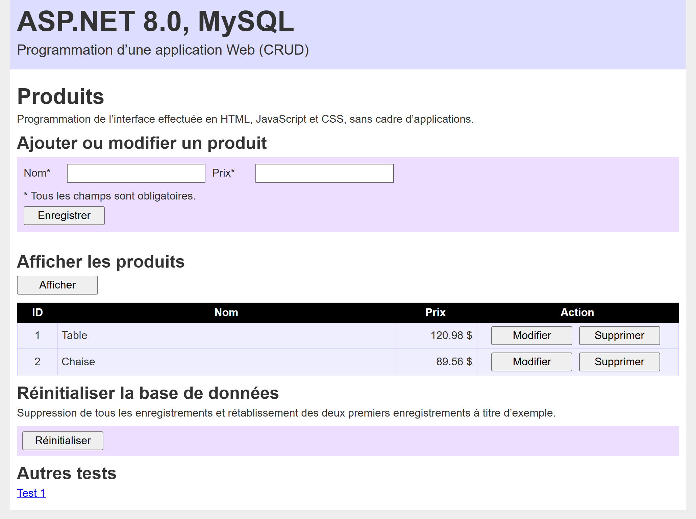

# aspnet-e07 &mdash; Programmation d’une application Web (CRUD)


## Création des fichiers ASP.NET Web API
À partir du dossier `aspnet-e07`, exécuter les commandes suivantes :
```sh
cd aspnet-e07
dotnet new webapi -n aspnet07
cd aspnet07
dotnet new gitignore
```

## Installation des dépendances requises
À partir du dossier `aspnet-e07/aspnet07`, exécuter les commandes suivantes :
```sh
cd aspnet-e07/aspnet07
dotnet add package Pomelo.EntityFrameworkCore.MySql --version 8.0.0
dotnet add package Microsoft.EntityFrameworkCore.Design --version 8.0.0
```

## Installation de l’application dotnet-ef
```sh
dotnet tool install --global dotnet-ef
```

## Port réservé à l’application aspnet-e07
> 5754

## Sous-répertoires et fichiers supplémentaires générés pour programmer l’application
```
/aspnet07/Controllers/ProductsControllers.cs
/aspnet07/Data/ApplicationDbContext.cs
/aspnet07/Models/Product.cs
```

## Sous-répertoires reliés à l’application
Voici les sous-répertoires reliés à l’application :
```
~/Documents/XD01/aspnet-e07/
/etc/apache2/sites-available/
/etc/systemd/system/
/var/www/aspnet07/
/var/www/html/d003/aspnet-e07/
```

## Commandes MySQL
Création de la base de données.
```sh
sudo mysql -u root -p
CREATE DATABASE aspnet07;
```
Exportation de la base de données.
```sh
sudo mysqldump -u root -p --routines --triggers --events aspnet07 > aspnet07.sql
```
Création de la procédure `reset_products()` dans la base de données `aspnet07`.
```sql
USE aspnet07;
DELIMITER $$
CREATE PROCEDURE reset_products()
BEGIN
    TRUNCATE TABLE Products;
    INSERT INTO Products (Name, Price) VALUES
        ('Table', 120.98),
        ('Chaise', 89.56);
END $$
DELIMITER ;
```
Importation de la procédure `reset_products()`.
```sh
sudo mysql -u root -p < procedure07.01.sql
```
Appel de la procédure `reset_products()`.
```sql
sudo mysql -u root -p
USE aspnet07;
CALL reset_products();
```

## Création des variables d’environnement temporaires
À utiliser pour tester l’application `aspnet-e07`. Les variables d’environnement temporaires sont accessibles uniquement à partir du terminal où elles ont été créées.
```sh
export database31=aspnet07
echo $database31
export user31=myusername
echo $user31
export password31=mypassword
echo $password31
```

## Création d’une nouvelle migration _Entity Framework Core_
```sh
dotnet ef migrations add InitialCreate
dotnet ef database update
```
S’il faut modifier la structure de la base de données, dans ce cas supprimer la base de données existante et le dossier `aspnet07/Migrations`. Créer une nouvelle base de données et répéter la procédure de création d’une nouvelle migration _Entity Framework Core_.

## Activation de l’application
À partir du terminal, saisir les commandes suivantes :
```sh
cd aspnet-e07/aspnet07
dotnet run --urls="http://localhost:5000"
```
L’application est disponible à partir de l’adresse URL suivante :
http://localhost:5000/api/products

## Accès à l’application ASP.NET à partir de Apache
Il ne faut pas que le serveur Web Kestrel (celui qui est intégré à ASP.NET Core) soit accessible directement depuis l’extérieur, comme un serveur Web public. Les fichiers doivent être localisés dans le sous-répertoire `/var/www/aspnet07`, et non dans le sous-répertoire `/var/www/html/aspnet07`.

## Configuration du serveur Apache
Dans le fichier `/etc/apache2/sites-available/default-ssl.conf`, ajouter les directives `ProxyPass` et `ProxyPassReverse`.
```conf
<VirtualHost *:443>
    ServerName 192.168.56.164

    SSLEngine on
    SSLCertificateFile /etc/ssl/certs/apache-selfsigned.crt
    SSLCertificateKeyFile /etc/ssl/private/apache-selfsigned.key

    ProxyPreserveHost On
    # Application aspnet-e07
    ProxyPass /api/products http://127.0.0.1:5754/api/products
    ProxyPassReverse /api/products http://127.0.0.1:5754/api/products

    ErrorLog ${APACHE_LOG_DIR}/error.log
    CustomLog ${APACHE_LOG_DIR}/access.log combined
</VirtualHost>
```

## Publication de l’application ASP.NET sur un serveur Web
À partir du terminal, saisir les commandes suivantes :
```sh
cd aspnet-e07/aspnet07
dotnet publish -c Release -r linux-x64 --self-contained true -p:PublishSingleFile=true
```
Les fichiers de publication sont générés dans le sous-répertoire suivant :
```sh
/aspnet-e07/aspnet07/bin/Release/net8.0/linux-x64/publish
```
Copier les fichiers dans le dossier suivant :
```sh
/var/www/aspnet07/
```
Appliquer les permissions suivantes :
```sh
sudo chown -R www-data:www-data /var/www/aspnet07
```
> Bogue à résoudre : Après avoir copié les nouveaux fichiers ASP.NET dans le dossier `/var/www/aspnet07`, il faut redémarrer la machine virtuelle pour que l’application fonctionne à nouveau.

Tester l’activation de l’application :
```sh
cd /var/www/aspnet
./aspnet07
```
L’application est disponible à partir de l’adresse URL suivante :
```
http://localhost:5754/api/products
```

## Publication de l’application sur un serveur Web en tant que service
Les fichiers compilés `ASP.NET` doivent être localisés dans le sous-répertoire suivant :
```sh
/var/www/aspnet07/
```
À partir du terminal, saisir la commande suivante :
```sh
sudo nano /etc/systemd/system/aspnet07.service
```
Dans le fichier `aspnet07.service`, intégrer le code suivant :
```conf
[Unit]
Description=ASP.NET 8.0 -- aspnet-e07
After=network.target

[Service]
WorkingDirectory=/var/www/aspnet07
ExecStart=/var/www/aspnet07/aspnet07
Restart=always
RestartSec=10
SyslogIdentifier=aspnet07
User=www-data
Environment=ASPNETCORE_ENVIRONMENT=Development
Environment=ASPNETCORE_URLS=http://localhost:5754
Environment="database31=aspnet07"
Environment="user31=myusername"
Environment="password31=mypassword"

[Install]
WantedBy=multi-user.target
```
À partir du terminal, saisir les commandes suivantes :
```sh
sudo systemctl daemon-reload
sudo systemctl enable aspnet07
sudo systemctl start aspnet07
sudo systemctl status aspnet07
```

## Commandes _curl_ à utiliser pour tester la base de données
Lire tous les enregistrements :
```sh
curl -X 'GET' 'http://localhost:5000/api/products' -H 'accept: application/json'
```
Créer un nouvel enregistrement :
```sh
curl -X 'POST' 'http://localhost:5000/api/products' -H 'Content-Type: application/json' -d '{"Name":"Table","Price":"120.98"}'
```
Supprimer un enregistrement :
```sh
curl -X 'DELETE' 'http://localhost:5000/api/products/1' -H 'accept: */*'
```
Réinitialiser la base de données MySQL :
```sh
curl -X 'POST' 'http://localhost:5000/api/products/reset'
```
